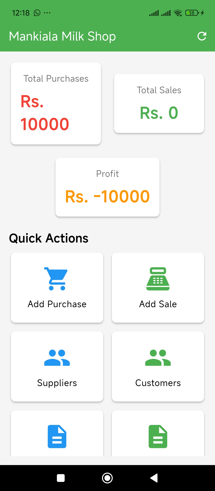
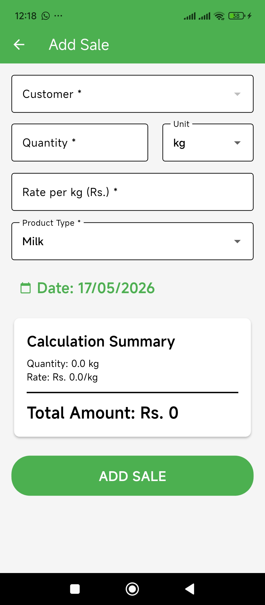
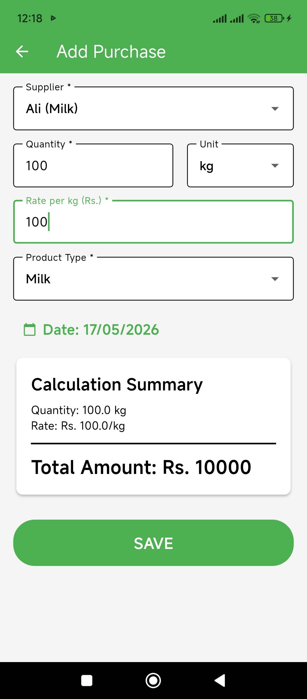
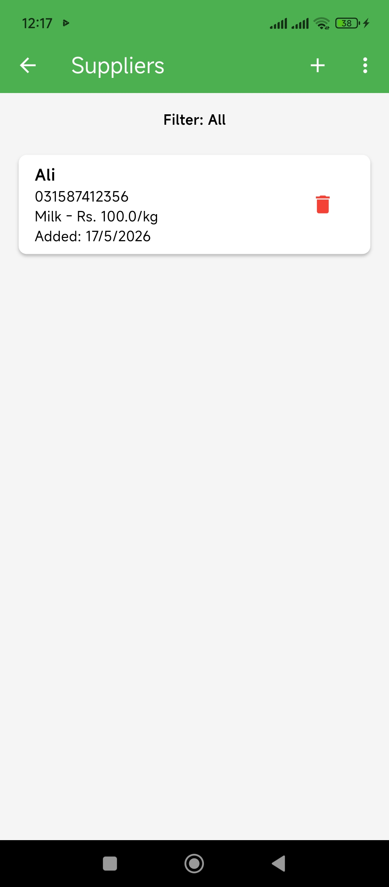
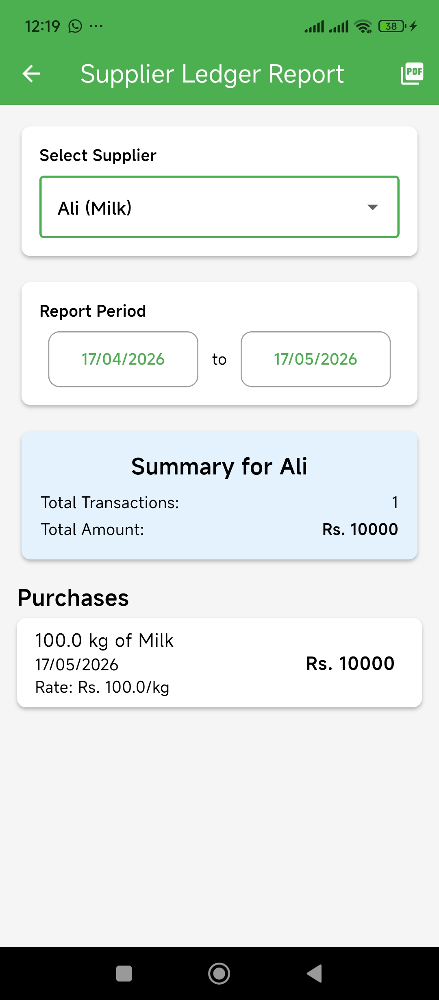
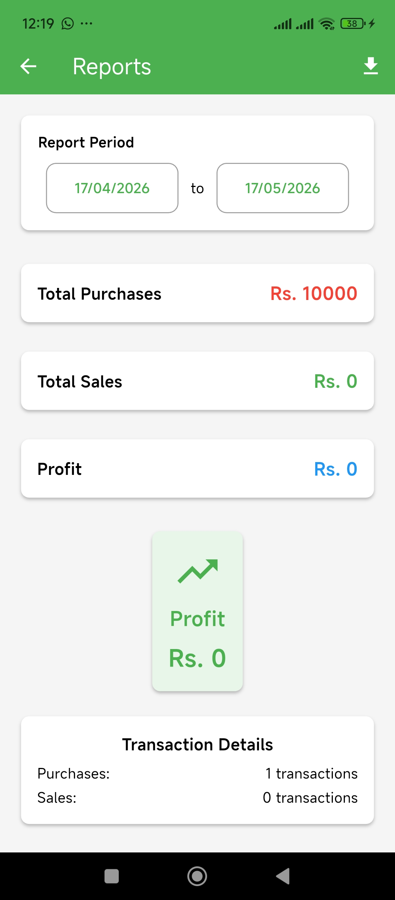
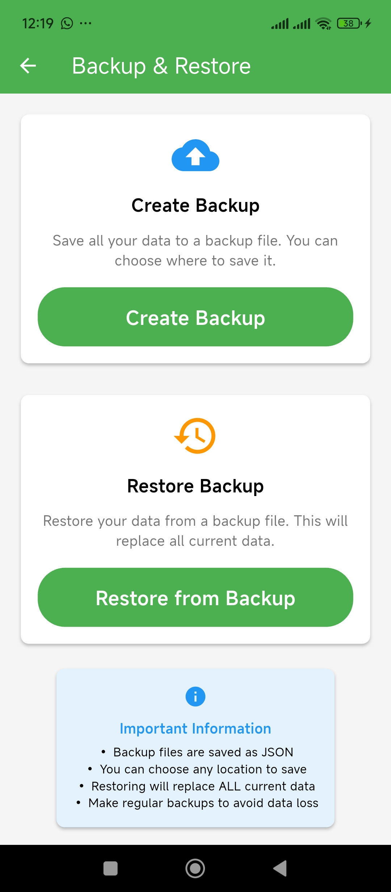

# Dairy Manager — Mankiala Milk Shop Manager

A comprehensive, offline-first dairy management application built with Flutter, designed to streamline the tracking of milk sales, purchases, customers, and suppliers. It features robust PDF reporting, secure local storage, and app activation controls.

---

## Features

- **Offline First**
  All data is stored locally using SQLite. No internet connection required.

- **Customer & Supplier Management**
  Easily manage profiles for both customers and milk suppliers.

- **Sales & Purchase Tracking**
  Record daily milk sales to customers and purchases from suppliers.

- **Ledger & Reports**
  Generate detailed ledger reports for specific date ranges.

- **PDF Generation & Printing**
  Export reports to PDF and print them directly from the app.

- **App Activation Security**
  Secure the app using a 6-digit activation code system.

- **Backup & Restore**
  Export and import database backups to prevent data loss.

---

## Screenshots

<table align="center">
  <tr>
    <td></td>
    <td></td>
    <td></td>
  </tr>
  <tr>
    <td align="center">Dashboard</td>
    <td align="center">Add Sale</td>
    <td align="center">Add Purchase</td>
  </tr>
  <tr>
    <td></td>
    <td></td>
    <td></td>
  </tr>
  <tr>
    <td align="center">Suppliers List</td>
    <td align="center">Create Ledger Report</td>
    <td align="center">View Report</td>
  </tr>
  <tr>
    <td></td>
    <td></td>
    <td></td>
  </tr>
  <tr>
    <td align="center">Backup & Restore</td>
    <td></td>
    <td></td>
  </tr>
</table>

---

## Tech Stack

- **Framework**: Flutter
- **State Management**: GetX
- **Database**: SQLite (sqflite)
- **Reporting**: PDF & Printing packages
- **Storage**: Shared Preferences

---

## Project Structure

```
lib/
├── main.dart                     # App entry point
├── core/
│   ├── database/
│   │   └── database_helper.dart  # SQLite database helper
│   ├── theme/
│   │   └── app_theme.dart        # App theme configuration
│   └── services/
│       └── activation_service.dart # App activation logic
├── data/
│   ├── models/
│   │   ├── customer_model.dart   # Customer data model
│   │   ├── purchase_model.dart   # Purchase data model
│   │   └── sale_model.dart       # Sale data model
│   └── repositories/
│       ├── customer_repository.dart # Customer data access
│       └── sale_repository.dart     # Sale data access
└── modules/
    ├── dashboard/                # Dashboard screen
    ├── customers/                # Customer management
    ├── suppliers/                # Supplier management
    ├── sales/                    # Sales tracking
    └── purchases/                # Purchase tracking
```

---

## Flow & Approach

### Architecture
The app follows the **GetX pattern** with a clear separation of concerns among Views, Controllers, and Bindings. This ensures that the UI remains separate from the business logic.

### Data Access
A **Repository pattern** is used to abstract the data source (SQLite) from the business logic. Controllers interact with repositories rather than querying the database directly.

### Offline-First
The app operates entirely offline, making it reliable for dairy shops in areas with poor or no internet connectivity. Data is persisted in a local SQLite database.

---

## Technical Details

### Database
The app uses SQLite for local data persistence. It manages tables for:
- **Customers**: Stores customer details and balances.
- **Suppliers**: Stores supplier details and balances.
- **Sales**: Records milk sales transactions.
- **Purchases**: Records milk purchase transactions.

### App Activation
To secure the app, an activation flow is implemented:
- A pre-defined list of valid activation codes is stored in the app.
- On first launch, the user must enter a valid code.
- Used codes are tracked in `SharedPreferences` to prevent reuse.

---

## Getting Started

### Prerequisites

- Flutter SDK
- Android Studio or VS Code
- Android SDK

### Installation

1. **Clone the repository**
   ```bash
   git clone https://github.com/yourusername/dairy_manager.git
   cd dairy_manager
   ```

2. **Install dependencies**
   ```bash
   flutter pub get
   ```

3. **Run the app**
   ```bash
   flutter run
   ```

---

## Usage Guide

### App Activation
1. On first launch, enter a valid 6-digit activation code.
2. Once activated, the app will open to the Dashboard.

### Recording Sales
1. Navigate to the Sales section.
2. Tap **Add Sale**.
3. Select a customer, enter the quantity, rate, and save.

### Generating Reports
1. Navigate to the Reports section.
2. Select Customer or Supplier report.
3. Choose the date range and tap **Generate**.
4. You can view, export to PDF, or print the report.

---

## Author

**Abdul Sami**

- GitHub: [@5-abdulsami](https://github.com/5-abdulsami)
- Website: [abdulsami.live](https://abdulsami.live/)
- Email: [5abdulsami2004@gmail.com](mailto:5abdulsami2004@gmail.com)
- LinkedIn: [Abdul Sami](https://www.linkedin.com/in/5abdul-sami/)
